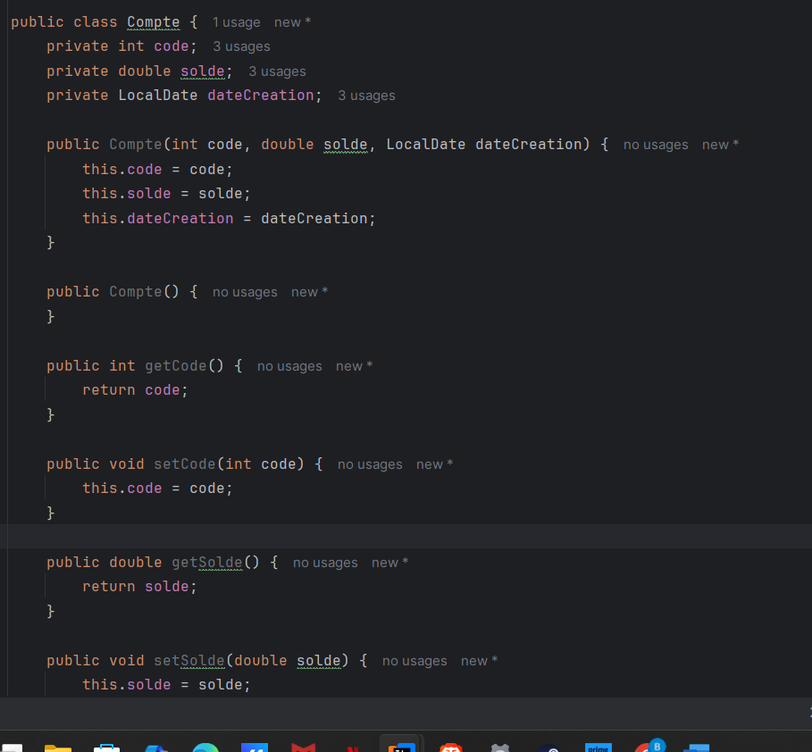

# GUINDO BADARA ALIOU MSDIA FSM
### MASSAR 2100000017

# TP 4

# Création d'un projet Java Maven simple

## Création d'une classe `BanqueService`

La classe `BanqueService` représente un service simple. Elle contient une méthode `Conversion` qui prend un montant en paramètre et retourne sa conversion (par exemple en dirhams si le taux est 11). La méthode `getCompte` pourrait être utilisée pour retourner un objet `Compte` représentant un compte bancaire.

## Création de la classe `Compte`

La classe `Compte` représente un modèle de compte bancaire. Elle contient trois attributs : un `code` (identifiant du compte), un `solde`, et une `dateCreation` de type `LocalDate`. La classe fournit un constructeur vide, un constructeur avec tous les champs, ainsi que les getters et setters nécessaires pour accéder et modifier les données du compte.

## Ajout de la dépendance `jaxws-ri` dans `pom.xml`

On ajoute la dépendance `jaxws-ri` dans le fichier `pom.xml` pour utiliser les fonctionnalités de **JAX-WS**, qui permet de créer et de consommer des services web de type **SOAP** en Java. Cette dépendance fournit l'implémentation de référence (Reference Implementation) de l'API JAX-WS, nécessaire pour publier des classes Java annotées avec `@WebService` ou `@WebMethod`. Elle est essentielle pour permettre à l'application de fonctionner comme un service web ou d’interagir avec d'autres services SOAP.

## Utilisation des annotations JAX-WS

Grâce à la dépendance `jaxws-ri` ajoutée dans le fichier `pom.xml`, on a pu utiliser les annotations de **JAX-WS** comme `@WebService`, `@WebMethod` et `@WebParam`. Ces annotations permettent de transformer la classe Java (`BanqueService`) en un **service web SOAP** et de rendre ses méthodes accessibles à distance. Par exemple, `@WebService` expose la classe comme service, `@WebMethod` rend une méthode accessible via le WSDL, et `@WebParam` permet de nommer clairement les paramètres dans les requêtes SOAP.

## Déploiement du service avec `SserverJWS`

Ensuite, on a ajouté une classe `SserverJWS` qui contient une méthode `main` permettant de **déployer le service web**. Grâce à l'import de `jakarta.xml.ws.Endpoint`, on utilise la méthode `Endpoint.publish()` pour publier le service `BanqueService` sur l'URL `http://0.0.0.0:9090/BanqueWS`. Cela permet de lancer manuellement le serveur et de rendre le service SOAP accessible à distance via un navigateur ou un client SOAP. Un message de confirmation est affiché dans la console pour indiquer que le service est bien déployé.

## Test avec SoapUI

Ensuite, on a utilisé **SoapUI** pour tester le service web.  
Dans la fenêtre de création d'un nouveau projet SOAP, on a saisi l'URL du WSDL (`http://localhost:9090/BanqueWS?wsdl`) généré par notre service `BanqueService`. SoapUI a automatiquement importé toutes les opérations disponibles dans le service (comme `ConversionEuroToDH`, `getCompte`, `listComptes`) et a généré des requêtes d'exemple. Cela permet de tester et d'exécuter facilement les méthodes du service sans écrire de code client.

## Création d’un module client

On ajoute un nouveau **module Maven** dans le projet `client-soap-java` pour créer un **client Java** capable de consommer un service web SOAP. Ce module aura son propre fichier `pom.xml`, ses sources Java dans `src/main/java`, et contiendra une classe `Main` dans le package `org.example`.

## Génération du proxy

On génère ce proxy :

